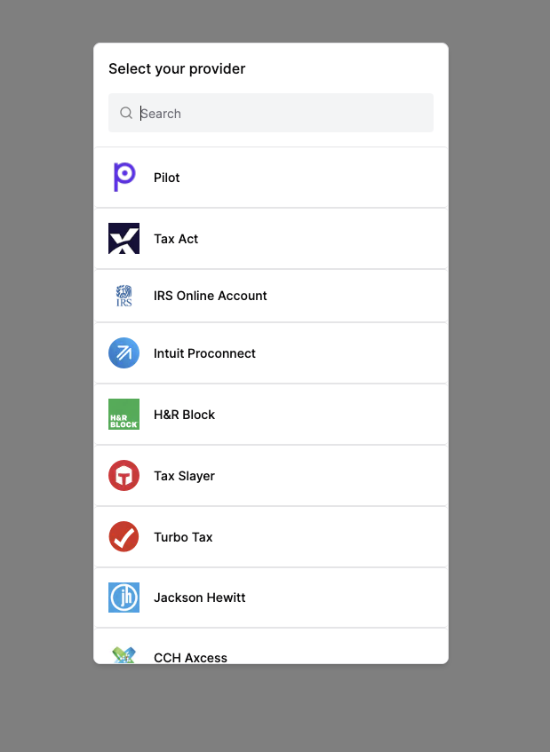

To get started, sign up for a free account [here](https://dashboard.trychartapi.com/signup). 
After registration, you will have access to your OAuth application `client_id` and `client_secret` 
to build and test how Chart works.

<Note>This client_id and client_secret will only work for the TurboTax provider and only for a limited
number of submissions. If you would like to test all the providers with unrestricted submissions, 
please contact developers@trychartapi.com.</Note>

## Open Chart Connect

Chart Connect provides a secure and elegant authorization flow for your users
to grant your application access to their tax records.

<Warning>
Note: this quickstart guide is a simplified, but manual way of generating an authorization `code` 
and exchanging it for an `access_token`, which can be used to subsequently call our APIs. 
In a true production environment, 
you will want to automate this process completely inside your application's code.
</Warning>

Since this quickstart assumes you have not built an application yet, 
we must make sure that a proper `redirect_uri` is set up before continuing or
our authorization code generation will fail.
In your [Chart Dashboard](https://dashboard.trychartapi.com/signup), go to the “Redirect URIs” 
section and select `+ Add Redirect URI`. We are going to use https://example.com for testing purposes. 
In production, you will want to use your own application's urls for the Redirect Uris 
(and remove all mentions of https://example.com or http://localhost).

Redirect URIs are only needed if you are redirecting to Chart Connect. 
If you decide to use our embedded Chart Connect flow, you do not need to specify a `redirect_uri`; 
the SDK does this for you.

We will launch **Chart Connect** - our secure and elegant authorization flow 
for your users to grant your application access to their systems - by constructing and navigating 
to the following URL on your browser. Copy the url below, open up your favorite text editor 
(Notes, TextEdit, VS Code, etc), paste, and replace `<your_client_id>` with the client id found 
in your [Chart Dashboard](https://dashboard.trychartapi.com/signup). 
Remove the angle brackets when replacing `<your_client_id>`.

```shell
https://connect.trychartapi.com/authorize?
client_id=<your_client_id>
&redirect_uri=https://example.com
```

## Log in to a TurboTax account

Select the TurboTax provider on the selector page and log in with real Intuit credentials.


## Exchange the authorization code for an access token

After successfully logging in via Chart Connect, your browser will be redirected to `https://example.com` 
with the query parameter `code` in the browser URL. Copy the `code` from the url and save it in your text editor. 
In a production system, however, the browser will redirect to your url and 
your application will automatically copy the `code` and perform the remaining steps programmatically.

To exchange the `code` for a token, we use the curl command below. Copy the code below, 
paste into your text editor, replace the `<your_authorization_code>` in the command with the one 
you saved above (making sure to not include the angle brackets).

<CodeGroup>

```shell Request
curl https://api.trychartapi.com/auth/token \
-X POST \
-H "Content-Type: application/json" \
--data-raw '{
    "client_id": "<your_client_id>",
    "client_secret": "<your_client_secret>",
    "code": "<your_authorization_code>",
    "redirect_uri": "https://example.com"
}'
```

```javascript Response
{
  "account_id": "ac3a2af9-ce03-46c4-9142-81abe789c64d",
  "provider_id": "turbotax",
  "access_token": "7e965183-9332-423c-9259-3edafb332ad2"
}
```

</CodeGroup>

<Check>
**Congratulations!**

You have sent your first request to Chart's API. The next step is to integrate Chart Connect onto your application.
</Check>