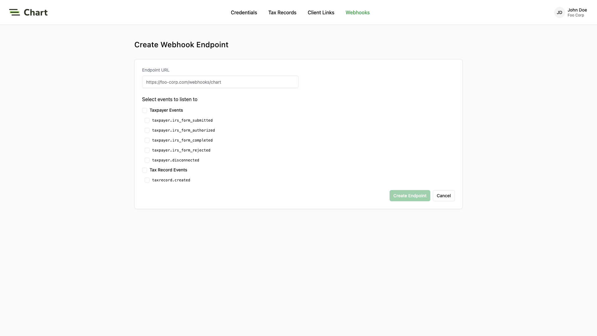
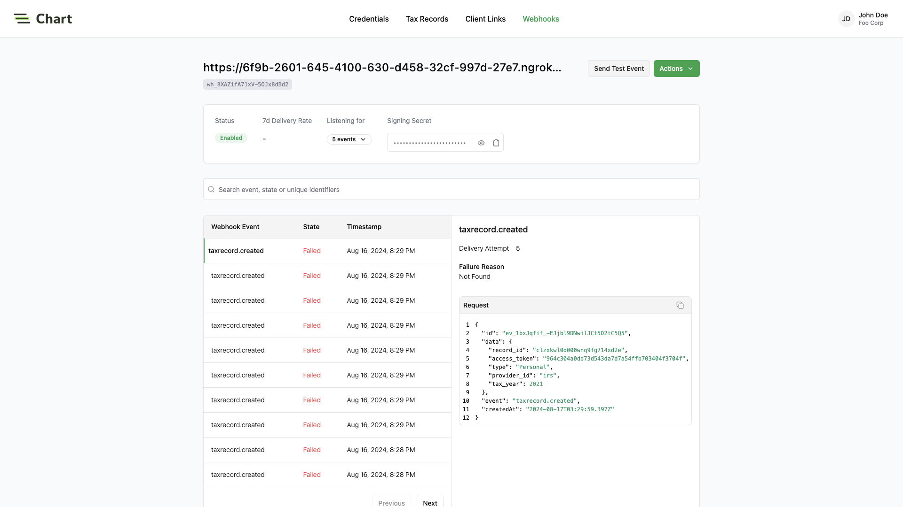

## What you'll build

In this guide, we will walk you through what you will need to set up webhooks:
- Create your endpoint to receive webhook events
- Register your endpoint with Chart
- Process the events received from Chart
- Test your endpoint

## 1. Set up your webhook endpoint

Create a public endpoint that Chart can send events to. This endpoint should use HTTPS and 
should accept POST requests with the `chart-signature` header.

<CodeGroup>

```javascript Next.js
import type { NextApiRequest, NextApiResponse } from 'next';

export default (req: NextApiRequest, res: NextApiResponse) => {
  if (req.method === 'POST') {
    const payload = req.body;
    const sigHeader = req.headers['chart-signature'];

    // Verify the signature and process the event
    res.status(200).end();
  }
};
```

```javascript Express
const express = require('express');
const app = express();

app.use(express.json());

app.post('/webhook', (req, res) => {
  const payload = req.body;
  const sigHeader = req.headers['chart-signature'];

  // Verify the signature and process the event
  res.sendStatus(200);
});
```

</CodeGroup>

<Note>
Chart sends the header as Chart-Signature, but many web servers normalize HTTP request headers to their lowercase variants.
</Note>

## 2. Register your endpoint

Set and save the webhook URL in the [Chart Dashboard](https://dashboard.trychartapi.com), so Chart knows where to deliver the events. 
Your webhook endpoints should only be configured to receive the ones required by your integration.
Receiving all event types can put undue strain on your servers and is not recommended.

<Frame type="glass">

</Frame>

## 3. Process the events

In order to avoid unnecessary retry requests hitting your webhook handler, 
we recommend using two concurrent processes for handling events: one for receiving the event,
and the other for processing it.

###  Respond with HTTP 200 OK
On receiving an event, you should respond with an `HTTP 200 OK` to signal to Chart that the event was successfully delivered. 
Otherwise, Chart will consider the event delivery a failure and retry up to 12 times, with exponential backoff over 3 days.
You do not need to signal to Chart whether or not the event was processed successfully.

### Validate the requests

Before processing the request payload, verify the request was sent by Chart and not an unknown party.

Chart includes a unique signature in each webhook request that it sends, allowing you to verify the authenticity of the request. 
In order to verify this signature, you must obtain the secret that is generated for you when you set up your webhook endpoint in the Chart dashboard. 
Ensure that this secret is stored securely on your webhook endpoint server as an environment variable.

To implement webhook validation, you'll need to use the following steps:

First, extract the timestamp and signature from the header. 
There are two values to parse from the `Chart-Signature`header, delimited by a `,` character.


| Key             | Value                                                                                           |
| --------------- | ----------------------------------------------------------------------------------------------- |
| issued_timestamp| The number of milliseconds since the epoch time at which the event was issued, prefixed by `t=` |
| signature_hash  | The HMAC SHA256 hashed signature for the request, prefixed by `v1=`                             |


To avoid replay attacks, we suggest validating that the `issued_timestamp` does not differ too much from the current time.

Next, construct the expected signature. The expected signature is computed from the concatenation of:

1. `issued_timestamp`
2. The `.` character
3. The request's body as a utf-8 decoded string

Hash the string using HMAC SHA256, using the webhook secret as the key. The expected signature will be the hex digest of the hash.
Finally, compare signatures to make sure the webhook request is valid.

Once you've determined the event request is validly signed, it's safe to use the event payload in your application's business logic.

## 4. Test your endpoint
From the dashboard, you can send test webhook events after configuring an endpoint.
Go to the webhook endpoint detail page, click on **Send Test Event**. 
The types of events that you have configured for your endpoint are available for you to send sample payloads.

<Frame type="glass">

</Frame>

If you would like to test against your local development environment, we recommend using a tool like 
[ngrok](https://ngrok.com/) to create a secure tunnel to your local machine, and sending test webhooks to the public endpoint generated with ngrok.

## Best practices

### Respond to events immediately
To avoid webhook requests potentially stressing your system, 
Chart strongly recommends that you respond to a webhook request with a 200 OK response as quickly as possible once received.

If you process the event before responding, your system may not be able to handle a spike of requests. 
This may cause requests to timeout and result in missing important updates.

A common pattern is to store the request payload on a message queue, respond with a 200 OK response, 
and use a background worker to process the messages in the queue.

### Recover from failed events
If your endpoint fails to respond to a webhook request with a `2xx` response, 
Chart will automatically retry the event with exponential back-off for up to 3 days in production environments.
If for some reason your endpoint is still unable to respond successfully to events during that period, 
the event will be considered failed, and we will no longer retry sending it.


### Handle out-of-sequence events
Chart does not guarantee that events are delivered in the same sequence that they are generated. 
For example, when a taxpayer going thru Chart Connect UI, you may receive:

- `taxpayer.consent_accepted`
- `taxpayer.provider_selected`
- `taxpayer.provider_connected`

Your endpoint should handle cases when these events are delivered out of order. 
Each event includes the full payload of the objects involved, so you can perform an upsert using the payload data.

It is also possible that event data can be stale due to a retry of an older event being delivered after a newer event for the same object. 
Therefore, we recommend checking the timestamp of the incoming webhook data 
against the timestamp of the data in your system to ensure you do not overwrite your data with stale data.
Each object in the payload includes a `created_at` field and an `updated_at` field.

### Ignore duplicate events
It is possible to receive the same event more than once. Chart recommends that you handle webhook events using idempotent operations. 
One way of doing this is logging the ID of webhook events that you have processed and ignoring subsequent requests with the same ID.

### Obfuscate your endpoint URL
A small security measure you can incorporate is to make your webhook endpoint difficult to guess. 
Including a token comprised of series of random numbers and letters to your endpoint URL can prevent malicious actors from easily guessing your endpoint. 
For example: https://api.example.com/webhooks/n0dbga5x… is much more difficult to guess than https://api.example.com/webhooks